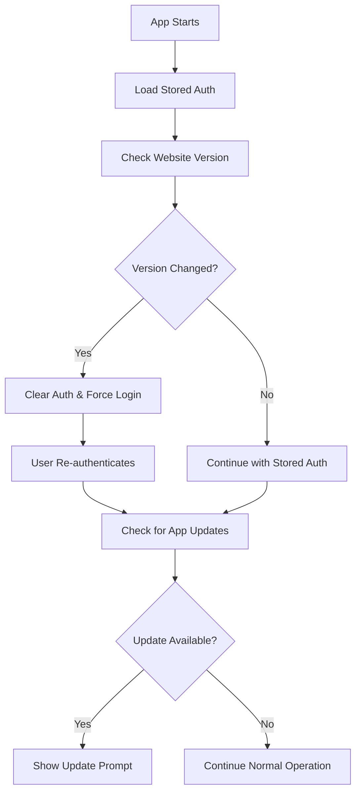

# Version Endpoint Specification

## Overview
This document specifies the API endpoint structure needed on your website (`https://api.icantcode.app/version`) to support automatic version checking and update prompts in the desktop application.

## Endpoint Details

### URL
```
GET https://api.icantcode.app/version
```

### Headers
The desktop app will send the following headers:
```
Content-Type: application/json
User-Agent: i-cant-code/{current_app_version}
```

### Response Format

#### Success Response (200 OK)
```json
{
  "appVersion": "1.0.1",
  "websiteVersion": "2.1.0", 
  "releaseNotes": "Bug fixes and performance improvements. Added new AI model support.",
  "downloadUrl": "https://icantcode.app/download"
}
```

#### Response Fields

| Field | Type | Required | Description |
|-------|------|----------|-------------|
| `appVersion` | string | Yes | Latest available desktop app version (semantic versioning) |
| `websiteVersion` | string | Yes | Current website/API version for tracking website updates |
| `releaseNotes` | string | No | Human-readable description of what's new in the latest version |
| `downloadUrl` | string | No | Direct URL where users can download the latest version |

#### Error Response (4xx/5xx)
```json
{
  "error": "Version check temporarily unavailable",
  "code": "SERVICE_UNAVAILABLE"
}
```

## Desktop App Behavior

### Version Checking Logic

1. **App Version Comparison**: 
   - Compares `appVersion` from API with current app version
   - Uses semantic versioning comparison (1.0.1 > 1.0.0)
   - Shows update prompt if API version is newer

2. **Website Version Tracking**:
   - Stores `websiteVersion` in persistent auth storage
   - Forces re-authentication if `websiteVersion` changes
   - This ensures users re-login when you deploy website updates

3. **Update Prompts**:
   - Shows prominent update banner in settings when update available
   - Includes release notes and download button
   - Users can dismiss or download immediately

### When Version Checks Occur

- **App Startup**: Checks in background during auth loading
- **Settings Page**: Checks when user opens settings
- **Manual Refresh**: User can force check with "Force Refresh" button
- **Periodic**: Every 30 seconds while settings page is open

### Authentication Flow Integration



## Implementation Examples

### Node.js/Express Example
```javascript
app.get('/version', (req, res) => {
  const currentAppVersion = '1.0.1'; // Your latest app version
  const currentWebsiteVersion = '2.1.0'; // Increment when you deploy
  
  res.json({
    appVersion: currentAppVersion,
    websiteVersion: currentWebsiteVersion,
    releaseNotes: 'Bug fixes and new features',
    downloadUrl: 'https://icantcode.app/download'
  });
});
```

### Static JSON Example
If you prefer a static approach, you can serve a JSON file:

```json
{
  "appVersion": "1.0.1",
  "websiteVersion": "2.1.0",
  "releaseNotes": "Latest improvements and bug fixes",
  "downloadUrl": "https://icantcode.app/download"
}
```

## Deployment Workflow

### For App Updates
1. Build and release new desktop app version (e.g., 1.0.1)
2. Update `appVersion` in the endpoint to "1.0.1"
3. Update `releaseNotes` with changelog
4. Users will see update prompt on next version check

### For Website Updates  
1. Deploy your website changes
2. Increment `websiteVersion` (e.g., "2.0.0" → "2.1.0")
3. Users will be forced to re-authenticate on next app start
4. After re-auth, they'll see any available app updates

## Error Handling

The desktop app gracefully handles:
- Network timeouts (5-10 second timeout)
- HTTP errors (4xx/5xx responses)
- Malformed JSON responses
- Missing endpoint (continues with cached versions)

## Security Considerations

- Endpoint should be publicly accessible (no authentication required)
- Consider rate limiting to prevent abuse
- Use HTTPS for all communications
- Validate version strings to prevent injection attacks

## Testing

You can test the integration by:

1. **Mock Endpoint**: Create a test endpoint with different version numbers
2. **Force Version Change**: Temporarily change `websiteVersion` to trigger re-auth
3. **Update Simulation**: Set `appVersion` higher than current to test update prompts
4. **Network Errors**: Test with endpoint returning 500 errors

## Benefits

✅ **Automatic Updates**: Users get notified about new versions automatically  
✅ **Website Sync**: Users re-authenticate when you deploy important changes  
✅ **User Experience**: Clear update prompts with download links  
✅ **Flexibility**: You control when to force re-auth vs just show update prompts  
✅ **Graceful Degradation**: App continues working if endpoint is unavailable  

This system gives you full control over user authentication and update notifications while providing a seamless experience for your users.
